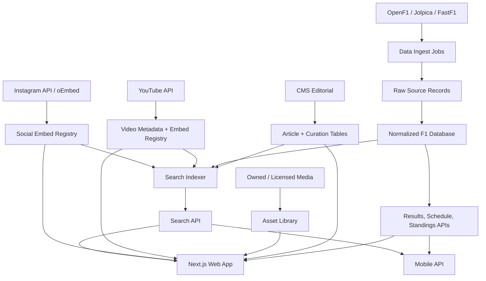

# Formula 1 Fan Platform Phase 1 PID

> **Planning status:** Product and system design only. No implementation started in this document.
>
> **Companion document:** `FORMULA1_SYSTEM_DESIGN_PLAN.md`
>
> **Working product name:** Apex / Velocity Verse, pending final brand decision.
>
> **Core ambition:** Build a world-class Formula 1 fan platform with Formula1.com-level functional parity for schedule, results, news, drivers, and teams, then expand into a sharper startup product with live race tools, social video discovery, historical archive depth, and mobile-first fan workflows.

---

## 1. Executive Intent

The first product layer is a high-fidelity fan remake of the official Formula1.com experience. The target is not a loose motorsport blog. The target is a serious race-week operating surface: users should land on the website and immediately understand what race is next, what happened last, what changed in the championship, what news matters, who the drivers are, which teams are competing, and where to go next.

The second product layer is where the startup becomes more than a remake. Formula1.com is the reference for trusted official coverage, but a fan-first startup can compete by being faster to scan, deeper historically, stronger on social discovery, cleaner on personalization, and better as a live companion. The startup opportunity is to become the F1 fan's command center across official data, open data, licensed media, curated social content, race history, and mobile notifications.

The right Phase 1 outcome is:

- A web platform that matches the core information architecture of Formula1.com for schedule, results, news, drivers, and teams.
- A content and data system that can stay updated without manual chaos.
- A safe media strategy that avoids unauthorized copying of Formula1.com assets, F1 TV streams, article text, logos, protected marks, or videos.
- A design system that feels premium, kinetic, editorial, technical, and startup-grade rather than like a cheap clone.
- A clean foundation for Android-first mobile apps and later iOS parity.

---

## 2. Hard Boundary: Functional Parity, Not Asset Theft

We can build the same product category, the same page inventory, the same user journeys, the same data structures, and the same component behaviors. We should not copy Formula1.com code, CSS, images, logos, video files, F1 TV streams, article text, proprietary timing feeds, or exact trade dress for a commercial launch.

The correct wording for the build is:

- **Allowed target:** "Formula1.com-level functional parity."
- **Allowed target:** "A fan platform with schedule, results, news, drivers, teams, videos, standings, race center, archive, and mobile app."
- **Allowed target:** "A premium racing interface inspired by the structure of official racing media products."
- **Unsafe target:** "Word-for-word copy of Formula1.com."
- **Unsafe target:** "Scrape all F1 images and videos and stream them through our website."
- **Unsafe target:** "Use official Formula 1 branding in a way that implies affiliation."

The public startup version needs a visible disclaimer:

> Apex is an unofficial motorsport fan platform. It is not affiliated with Formula 1, FIA, Formula One Management, any Formula 1 team, or any driver unless explicitly stated.

This is not a creativity limit. It is how the product survives long enough to become real.

---

## 3. Existing Plan Readback

The current `FORMULA1_SYSTEM_DESIGN_PLAN.md` already establishes the core technical read of Formula1.com:

- Formula1.com behaves like a modern server-rendered React/Next-style site with CDN caching, image transformation URLs, large navigation payloads, structured content pages, race data modules, and media/video surfaces.
- The observed global shell has a utility commercial strip, sign-in/subscribe links, a race ticker, mega menus, mobile menu behavior, footer links, app promotion, partner blocks, analytics attributes, cookie consent, and external commerce links.
- The observed media path uses transformed image URLs under Formula 1-owned media infrastructure. For our product, that implies a first-party asset library plus an image transformation service, not hotlinking.
- The observed video path uses official video players and thumbnails. For our product, that implies official embeds, licensed video, or owned video, not video ripping.
- The observed data pages require normalized models for seasons, races, sessions, drivers, teams, results, standings, articles, videos, partners, and navigation.
- The recommended stack in the existing plan is Next.js App Router, PostgreSQL, Redis, object storage, image CDN, search, queues, analytics, auth, CMS, ingestion workers, live timing workers, and revalidation workers.

This PID extends that file from "system design teardown" into "startup-ready product, data, API, legal, mobile, and execution plan."

---

## 4. Formula1.com Feature Map

### 4.1 Global Shell

The global shell is the skeleton that appears across the Formula1.com pages inspected.

Required modules:

- Skip-to-content accessibility link.
- Top commercial utility bar:
  - Authentics.
  - Store.
  - Tickets.
  - Hospitality.
  - Experiences.
  - F1 TV.
  - Sign In.
  - Subscribe.
- Primary brand/navigation bar.
- Race ticker:
  - Previous race.
  - Next race.
  - Upcoming races.
  - Round number.
  - Race location.
  - Date range.
  - Status label such as previous, next race, upcoming, completed, testing.
- Mega navigation:
  - Schedule.
  - Results.
  - News.
  - Drivers.
  - Teams.
  - Fantasy and gaming.
  - FIA link.
- Mega menu preview content:
  - News article previews.
  - Video previews.
  - Driver list.
  - Team list.
  - Results links.
  - Schedule links.
- Mobile menu:
  - Same IA as desktop.
  - Collapsible groups.
  - Touch-friendly row heights.
  - Account actions.
- Cookie preference entry.
- Partner grid.
- App download promotion.
- Footer navigation.
- Social links.
- Copyright/disclaimer block.

Our equivalent:

- Keep the same information architecture depth.
- Replace official commerce links with either external "official links" clearly labeled, or our own future affiliate/licensed commerce modules.
- Use our own naming, iconography, design language, copy, and analytics attributes.
- Add startup differentiators such as personalized race ticker state, spoiler mode, and notification preferences.

### 4.2 Homepage

Observed Formula1.com homepage modules:

- Global shell.
- Hero story with large image, content label, title, and card link.
- Side/top secondary stories.
- Quick links:
  - Schedule.
  - Standings.
  - Regulations.
  - Latest news.
- Featured video rail.
- Editor's Picks section.
- Standings preview with driver/team tabs.
- 2026 highlights video rail.
- Commercial action cards:
  - Store.
  - Tickets.
  - Fantasy.
- Survey banner.
- Partner grid.
- App download promotion.
- Footer.

Our equivalent:

- Hero: latest major story or race-week lead.
- Secondary rail: 4 to 6 curated stories.
- Race command strip:
  - Next session countdown.
  - Local time conversion.
  - Circuit.
  - Weather.
  - Previous winner.
  - Watch/embed availability if legal.
- Featured video:
  - YouTube embeds.
  - Licensed/owned clips.
  - Official F1 YouTube embeds only when embeddable.
- Editor picks:
  - CMS-controlled.
  - Personalized fallback after user preferences exist.
- Standings preview:
  - Drivers tab.
  - Constructors tab.
  - Top 6 rows.
  - Full standings link.
- Social pulse:
  - YouTube trending.
  - Instagram embeds where authorized.
  - Creator posts where permission exists.
- Partner/app/footer blocks:
  - Ours, not copied from Formula1.com.

### 4.3 Schedule Tab

This is one of the Phase 1 base-case requirements.

Formula1.com schedule behavior to match functionally:

- Page title for selected season.
- Season selector.
- Add calendar action.
- Race ticker repeated near page top.
- Race card list.
- Testing cards.
- Completed race cards.
- Next race card.
- Upcoming race cards.
- Round number.
- Country flag.
- Country/location.
- Official race title.
- Date range.
- Circuit name on detail pages.
- Status icon or label:
  - Testing.
  - Completed.
  - Next race.
  - Upcoming.
- Completed result summary:
  - Winner.
  - Second place.
  - Third place.
  - Time/gap.
- Link to race detail.
- Link to results where available.
- Previous year link.
- Footer modules.

Our schedule must include:

- `/schedule`
- `/schedule/[season]`
- `/races/[season]/[round-or-slug]`
- Season tabs from 1950 to current season where data exists.
- Current-year default.
- Race states:
  - `testing`
  - `scheduled`
  - `race_week`
  - `in_progress`
  - `completed`
  - `postponed`
  - `cancelled`
- Localized times:
  - Browser timezone display.
  - Circuit local timezone.
  - UTC canonical storage.
- Session list:
  - Practice 1.
  - Practice 2.
  - Practice 3.
  - Sprint Qualifying.
  - Sprint.
  - Qualifying.
  - Grand Prix.
- Race detail modules:
  - Circuit map.
  - Circuit stats.
  - Lap count.
  - Circuit length.
  - Race distance.
  - First GP.
  - Lap record where legally sourced.
  - Weather forecast.
  - Session schedule.
  - News for this race.
  - Videos for this race.
  - Past winners.
  - Results tabs after completion.
- Add calendar:
  - One-click `.ics` download.
  - Season calendar feed.
  - Team/driver-specific reminder preferences later.

Acceptance criteria:

- A user can answer "When is the next race?" in under 5 seconds.
- A user can switch seasons without losing page context.
- Completed race cards show podium and timing gap data.
- Upcoming race cards show date, location, and session schedule.
- Calendar feed works in Google Calendar, Apple Calendar, and Outlook.

### 4.4 Results Section

This is one of the Phase 1 base-case requirements.

Formula1.com results behavior to match functionally:

- Results landing for current season.
- Driver standings.
- Team/constructor standings.
- Archive navigation from 1950 onward.
- Race-level results pages.
- Driver-specific standings detail pages.
- Race session tables:
  - Race result.
  - Qualifying.
  - Starting grid.
  - Sprint where applicable.
  - Sprint qualifying where applicable.
  - Practice sessions where data is available.
  - Fastest laps where data is available.
  - Pit stops where data is available.
- Season and race selectors.
- Driver filters on detail standings pages.
- Table columns with position, number, driver, nationality, team, time/status, points.

Our results must include:

- `/results`
- `/results/[season]/drivers`
- `/results/[season]/teams`
- `/results/[season]/races/[round]/race`
- `/results/[season]/races/[round]/qualifying`
- `/results/[season]/races/[round]/sprint`
- `/results/[season]/races/[round]/starting-grid`
- `/results/[season]/drivers/[driverSlug]`
- `/results/[season]/teams/[teamSlug]`
- Archive index from 1950 to current year.

Required result states:

- Classified.
- DNF.
- DNS.
- DSQ.
- NC.
- Lapped.
- Time/gap.
- Penalty note.
- Points.
- Fastest lap marker.

Acceptance criteria:

- Driver standings match the selected season.
- Constructor standings match the selected season.
- Race result tables are sortable on desktop and readable on mobile.
- Archive pages do not break when older seasons lack modern session types.
- Every imported data row preserves source attribution and fetch timestamp.

### 4.5 News

This is one of the Phase 1 base-case requirements.

Formula1.com news behavior to match functionally:

- Latest page.
- Category filters:
  - All.
  - Race-specific tags.
  - Analysis.
  - Technical.
  - Unlocked/member-style content.
  - Lifestyle and culture.
  - F2.
  - F3.
  - F1 Academy.
- Card grid.
- Image thumbnails.
- Labels:
  - Article.
  - Quiz.
  - Audio.
  - Video.
  - Betting.
  - Unlocked.
- Load more pagination.
- Article detail pages.
- Related content.
- News in the mega menu.
- News linked to drivers, teams, races, and topics.

Our news must include:

- `/news`
- `/news/[category]`
- `/news/[slug]`
- `/topics/[topicSlug]`
- `/races/[season]/[raceSlug]/news`
- `/drivers/[driverSlug]/news`
- `/teams/[teamSlug]/news`

Content sources:

- First-party editorial CMS.
- Licensed news feeds where budget allows.
- News API/GNews/Guardian-style APIs for headlines, links, metadata, and source discovery, subject to terms.
- Manual curation for high-value stories.
- No copy-pasting full Formula1.com articles.
- No scraping paid/member articles.

Article model:

- Title.
- Dek/summary.
- Slug.
- Author.
- Source.
- Source URL.
- Publish time.
- Updated time.
- Category.
- Tags.
- Race relation.
- Driver relation.
- Team relation.
- Hero media.
- Card media.
- Body blocks.
- Related content.
- SEO title.
- SEO description.
- Canonical URL.
- Rights status.

Acceptance criteria:

- Editors can publish a story without developer help.
- Every third-party story has source attribution.
- Feed cards clearly distinguish original editorial, linked external coverage, videos, audio, quizzes, and social embeds.
- Load more works without layout shift.
- News pages have structured data and fast first contentful paint.

### 4.6 Drivers

This is one of the Phase 1 base-case requirements.

Formula1.com driver behavior to match functionally:

- Current season driver grid.
- Driver cards with:
  - Name.
  - Team.
  - National flag.
  - Driver image/headshot.
- Driver detail page links.
- Cross-link to teams.
- Partner/footer modules.

Our driver system must include:

- `/drivers`
- `/drivers/[driverSlug]`
- Current season view.
- Historical season filter later.
- Driver card:
  - Full name.
  - Display surname/first name style.
  - Number.
  - Three-letter code.
  - Country flag.
  - Team.
  - Team color.
  - Headshot or owned/licensed/generated portrait style.
  - Current standing.
  - Points.
- Driver profile:
  - Bio.
  - Nationality.
  - Date of birth.
  - Place of birth.
  - Team.
  - Driver number.
  - Championships.
  - Wins.
  - Podiums.
  - Poles.
  - Fastest laps.
  - Career points.
  - Debut.
  - Current season results.
  - Recent news.
  - Recent videos/social embeds.
  - Career timeline.
  - Teammate comparison.

Acceptance criteria:

- Driver grid renders from data, not hardcoded cards.
- Driver profiles degrade gracefully when some older historical fields are missing.
- Users can jump from driver to team, driver standings, race results, and news.

### 4.7 Teams

This is one of the Phase 1 base-case requirements.

Formula1.com team behavior to match functionally:

- Current season team grid.
- Team cards with:
  - Team name.
  - Current drivers.
  - Team visual.
- Cross-link to drivers.
- Footer modules.

Our team system must include:

- `/teams`
- `/teams/[teamSlug]`
- Team card:
  - Team name.
  - Constructor name.
  - Driver pair.
  - Team color.
  - Car image or owned/licensed/generated visual.
  - Standing.
  - Points.
- Team profile:
  - Full name.
  - Base.
  - Team chief/principal where sourced.
  - Technical chief where sourced.
  - Chassis.
  - Power unit.
  - First entry.
  - Championships.
  - Wins.
  - Poles.
  - Fastest laps.
  - Current drivers.
  - Reserve/test drivers where sourced.
  - Current season result history.
  - Team news.
  - Team media.
  - Historical names/identity changes.

Acceptance criteria:

- Team pages stay accurate across roster changes.
- Historical constructor identity changes are modeled rather than overwritten.
- Teams link to current drivers, standings, results, and news.

---

## 5. Data And API Strategy

### 5.1 Data Source Tiers

Tier 1: Open/officially documented structured data

- OpenF1 for real-time and historical session data such as meetings, sessions, drivers, intervals, laps, pit data, race control, weather, car data, and position data.
- Jolpica F1 for Ergast-compatible historical seasons, races, results, standings, circuits, constructors, drivers, qualifying, laps, and pit stops.
- FastF1 for deeper analysis workflows, telemetry processing, event schedules, session objects, timing data, car telemetry, results data, and circuit information.

Tier 2: Licensed or approved editorial/media feeds

- Licensed news/photo/video provider.
- Team press kits where terms allow.
- Driver/team official media where permission allows.
- YouTube embeds through official YouTube Data API and IFrame Player.
- Instagram embeds or Graph API access with approved permissions.

Tier 3: First-party content

- Our CMS articles.
- Our race previews.
- Our analysis.
- Our generated graphics.
- Our original video/audio.
- Our newsletters and push notifications.

Tier 4: Manual editorial curation

- Manual verification of driver changes.
- Manual correction of race calendar changes.
- Manual source-of-truth overrides for breaking news.
- Manual social video curation when automated API access is limited.

### 5.2 API Matrix

| Product Area | Primary Source | Backup Source | Update Cadence | Key Risk | Phase 1 Decision |
|---|---|---|---:|---|---|
| Current schedule | Jolpica + OpenF1 + manual admin | FastF1 schedule | Daily, hourly during race week | Calendar changes and timezone accuracy | Build importer plus admin override |
| Historical schedule | Jolpica | FastF1 | One-time import, monthly refresh | Older seasons have missing modern fields | Normalize with nullable session types |
| Race results | Jolpica | FastF1 | After sessions complete | Official corrections after penalties | Import and reconcile with source timestamp |
| Driver standings | Jolpica | Calculated from results | After each race, daily refresh | Penalty/correction drift | Store imported and computed values |
| Constructor standings | Jolpica | Calculated from results | After each race, daily refresh | Constructor naming changes | Model team/constructor identity separately |
| Live timing | OpenF1 | FastF1 processing | 1s to 10s during sessions | Rate limits, availability, reliability | Phase 2/3, not core Phase 1 MVP |
| Weather | Weather API provider | Manual fallback | 15 min race week, daily otherwise | Location precision | Add for race detail once schedule exists |
| News | First-party CMS | Licensed/news APIs for links | Real-time editorial, 15 min feeds | Rights and duplication | Start CMS-first |
| Images | Owned/licensed/generative | Team/driver approved press media | On publish/import | Rights | Build asset library before scaling |
| YouTube videos | YouTube Data API + embeds | Manual playlist curation | 15 min to 6 hr | Quota and embeddability | Use whitelist channels and embed-only playback |
| Instagram reels | Instagram Graph API/oEmbed where approved | Manual embeds with permissions | 15 min to 6 hr | App review, media URL limits, rights | Plan as Phase 2, not MVP blocker |
| Push notifications | Firebase/APNs | Email fallback | Event-triggered | Spam/accuracy | Android MVP after web foundation |
| Search | Meilisearch/Typesense | Postgres full text | On publish/import | Ranking quality | Build in Phase 1 after CMS |

### 5.3 YouTube Integration

Use cases:

- Viral F1 videos.
- Official channel embeds where embeddable.
- Team channel embeds.
- Creator commentary embeds.
- Playlist rails by race, driver, team, topic, or trend.

Technical path:

- YouTube Data API `search.list` for video discovery.
- Use `type=video`.
- Use `videoEmbeddable=true`.
- Use `videoSyndicated=true` when the player must work outside YouTube.
- Use channel allowlists:
  - Official Formula 1 channel if embeddable.
  - Team channels.
  - Driver channels.
  - Approved creator channels.
- Use `videos.list` for statistics and content details after discovery.
- Use IFrame Player API for playback.
- Store only metadata:
  - YouTube video ID.
  - Title.
  - Channel.
  - Thumbnail URL from YouTube API.
  - Published time.
  - Duration.
  - View count if available.
  - Embeddable status.
  - Last checked time.
- Do not download videos.
- Do not rehost videos.
- Do not remove player branding in violation of YouTube policies.

Trending score:

```text
score =
  log10(view_count + 1) * 0.35
  + log10(like_count + 1) * 0.25
  + recency_weight * 0.25
  + editorial_boost * 0.15
```

### 5.4 Instagram Integration

Use cases:

- Viral F1 reels.
- Team posts.
- Driver posts.
- Creator reels.
- Race-week social wall.

Technical path:

- Instagram Graph API where the app has the correct business/creator permissions and passes Meta app review.
- Instagram oEmbed or official embed paths for public posts where allowed.
- Hashtag/media discovery only where the platform permits it for the approved app/account type.
- Manual curation fallback for launch.
- Store permalink and metadata, not downloaded media files, unless explicit rights exist.

Constraints:

- Instagram does not provide a simple unrestricted "give me all viral F1 reels" API.
- App review, account type, permissions, rate limits, and platform policy will shape what can be automated.
- Reposting, downloading, or re-streaming reels is not a safe default.
- The launch-safe version is an embed and curation system.

Data model:

- `social_posts`
  - `id`
  - `platform`
  - `external_id`
  - `permalink`
  - `embed_html`
  - `author_name`
  - `author_handle`
  - `caption_excerpt`
  - `thumbnail_url`
  - `published_at`
  - `fetched_at`
  - `rights_status`
  - `approved_by_editor_id`
  - `topic_ids`
  - `driver_ids`
  - `team_ids`
  - `race_id`

### 5.5 News API Strategy

The product should not depend on a generic news API as the editorial core. News APIs are useful for discovery, source monitoring, and metadata, but Formula 1 coverage quality requires curation and original writing.

Recommended setup:

- Phase 1:
  - First-party CMS.
  - Manual article publishing.
  - External link cards with source attribution.
- Phase 2:
  - NewsAPI/GNews/Guardian-style integrations for discovery.
  - Deduplication by canonical URL, title similarity, and source.
  - Editor approval before external stories hit homepage.
- Phase 3:
  - Licensed motorsport news feed.
  - Licensed images.
  - Contributor workflow.

External news card rules:

- Show headline only if allowed by source terms.
- Show short summary only if licensed or generated by our editorial team from public facts.
- Link to original source.
- Do not crawl paywalled full text.
- Do not impersonate the original publisher.
- Store source attribution visibly.

### 5.6 Media Asset Strategy

Media types:

- Article hero images.
- Article card thumbnails.
- Driver portraits.
- Team cards.
- Car imagery.
- Circuit maps.
- Race photos.
- Video thumbnails.
- Social thumbnails.
- Partner logos.
- App store badges.

Allowed asset sources:

- Original generated graphics.
- Original editorial illustrations.
- Licensed photo provider.
- Team/driver press assets where allowed.
- User-uploaded editorial assets with rights metadata.
- YouTube thumbnails through API for YouTube embeds.
- Instagram embed thumbnails where allowed by platform.

Asset pipeline:

- Upload original to object storage.
- Store checksum.
- Store creator/source/license.
- Store rights status:
  - `owned`
  - `licensed`
  - `platform_embed`
  - `public_domain`
  - `press_kit_allowed`
  - `unknown_blocked`
- Generate transforms:
  - `hero_16x9`
  - `card_16x9`
  - `portrait_3x4`
  - `avatar_square`
  - `logo`
  - `open_graph`
  - `mobile_hero`
- Store focal point.
- Store alt text.
- Store blurhash.

Do not:

- Hotlink Formula1.com images.
- Download F1 TV videos.
- Strip watermarks.
- Use team logos without permission for commercial pages.
- Use official F1 logos/marks in a way that suggests affiliation.

---

## 6. Recommended Technical Architecture

### 6.1 Web Stack

Recommended:

- Next.js App Router.
- TypeScript.
- React Server Components.
- Tailwind or token-driven CSS modules depending final app architecture.
- PostgreSQL.
- Drizzle ORM or Prisma.
- Redis.
- S3/R2 object storage.
- Cloudinary, Imgix, ImageKit, or a `sharp`-based image worker behind CDN.
- Meilisearch or Typesense.
- BullMQ, Trigger.dev, or Inngest for jobs.
- Auth.js, Clerk, or Supabase Auth.
- PostHog or Plausible for analytics.
- Sentry for errors.
- OpenTelemetry for service tracing.

### 6.2 Services

- `web`
  - Next.js SSR/ISR application.
  - Public website.
  - API routes or BFF layer.
- `cms`
  - Editorial admin.
  - Homepage curation.
  - Article publishing.
  - Media rights management.
- `data-ingest`
  - Jolpica importer.
  - OpenF1 importer.
  - FastF1 processing jobs.
  - Calendar sync.
- `media-worker`
  - Image transforms.
  - Blurhash.
  - Metadata extraction.
  - Rights validation checks.
- `video-ingest`
  - YouTube channel/playlist/search importer.
  - Embeddability checks.
  - Trend score calculation.
- `social-ingest`
  - Instagram integration after approval.
  - Manual embed ingestion.
  - Social post moderation queue.
- `search-indexer`
  - Article index.
  - Driver index.
  - Team index.
  - Race index.
  - Video/social index.
- `notification-worker`
  - Race reminders.
  - Breaking news.
  - Session start alerts.
  - Result alerts.
- `revalidate-worker`
  - Path revalidation after content/data changes.

### 6.3 Data Flow



### 6.4 Caching

Use Formula1.com-like cache behavior conceptually, tuned for our stack:

- Homepage:
  - CDN/ISR 60 seconds.
  - Stale-while-revalidate 5 minutes.
- News listing:
  - 60 to 180 seconds.
- Article detail:
  - Revalidate on publish/update.
  - 10 minute fallback.
- Schedule:
  - 1 hour normally.
  - 5 minutes during race week.
- Results:
  - 1 hour normally.
  - 1 minute after active sessions.
  - Manual purge after official correction.
- Driver/team pages:
  - 1 to 24 hours.
  - Purge on roster update.
- Video/social rails:
  - 15 minutes to 6 hours depending API quota.
- Live timing:
  - Redis TTL 5 to 30 seconds.
  - No static CDN cache for active session state.
- Images:
  - Immutable hashed URLs.
  - Long CDN cache.

---

## 7. Data Model

### 7.1 Core Racing Tables

- `seasons`
  - `id`
  - `year`
  - `name`
  - `is_current`
  - `created_at`
  - `updated_at`

- `circuits`
  - `id`
  - `slug`
  - `name`
  - `location`
  - `country`
  - `country_code`
  - `latitude`
  - `longitude`
  - `timezone`
  - `length_km`
  - `lap_record`
  - `first_grand_prix_year`
  - `asset_map_id`

- `races`
  - `id`
  - `season_id`
  - `round`
  - `slug`
  - `official_name`
  - `short_name`
  - `country`
  - `country_code`
  - `city`
  - `circuit_id`
  - `date_start`
  - `date_end`
  - `status`
  - `source_primary`
  - `source_updated_at`

- `sessions`
  - `id`
  - `race_id`
  - `type`
  - `name`
  - `starts_at_utc`
  - `ends_at_utc`
  - `local_timezone`
  - `status`
  - `openf1_session_key`
  - `source_updated_at`

- `drivers`
  - `id`
  - `slug`
  - `first_name`
  - `last_name`
  - `display_name`
  - `code`
  - `number`
  - `country`
  - `country_code`
  - `date_of_birth`
  - `birthplace`
  - `bio`
  - `portrait_asset_id`

- `constructors`
  - `id`
  - `slug`
  - `name`
  - `legal_name`
  - `base`
  - `country`
  - `country_code`
  - `color_primary`
  - `color_secondary`
  - `logo_asset_id`
  - `car_asset_id`

- `team_entries`
  - `id`
  - `season_id`
  - `constructor_id`
  - `display_name`
  - `power_unit`
  - `chassis`
  - `team_principal`
  - `technical_chief`
  - `first_entry_year`

- `driver_team_stints`
  - `id`
  - `driver_id`
  - `team_entry_id`
  - `season_id`
  - `start_date`
  - `end_date`
  - `is_primary`

- `session_results`
  - `id`
  - `session_id`
  - `driver_id`
  - `team_entry_id`
  - `position`
  - `classified_position`
  - `grid_position`
  - `laps`
  - `time`
  - `gap`
  - `status`
  - `points`
  - `fastest_lap`
  - `source_record_id`

- `driver_standings`
  - `id`
  - `season_id`
  - `race_id`
  - `driver_id`
  - `position`
  - `points`
  - `wins`
  - `source_record_id`

- `constructor_standings`
  - `id`
  - `season_id`
  - `race_id`
  - `constructor_id`
  - `position`
  - `points`
  - `wins`
  - `source_record_id`

### 7.2 Content Tables

- `articles`
  - `id`
  - `slug`
  - `title`
  - `dek`
  - `body_json`
  - `author_id`
  - `source_name`
  - `source_url`
  - `canonical_url`
  - `hero_asset_id`
  - `card_asset_id`
  - `status`
  - `published_at`
  - `updated_at`
  - `rights_status`

- `article_tags`
  - `article_id`
  - `tag_id`

- `tags`
  - `id`
  - `slug`
  - `name`
  - `type`

- `content_relations`
  - `id`
  - `content_type`
  - `content_id`
  - `relation_type`
  - `relation_id`

- `video_items`
  - `id`
  - `platform`
  - `external_id`
  - `title`
  - `description`
  - `channel_name`
  - `channel_id`
  - `thumbnail_url`
  - `duration_seconds`
  - `published_at`
  - `embed_url`
  - `embeddable`
  - `syndicated`
  - `view_count`
  - `like_count`
  - `trend_score`
  - `last_checked_at`
  - `rights_status`

- `social_posts`
  - Fields listed in section 5.4.

- `media_assets`
  - `id`
  - `storage_key`
  - `original_url`
  - `source_name`
  - `license_type`
  - `rights_status`
  - `credit`
  - `alt_text`
  - `focal_x`
  - `focal_y`
  - `blurhash`
  - `width`
  - `height`
  - `mime_type`
  - `checksum`
  - `created_at`

### 7.3 Operations Tables

- `source_records`
  - `id`
  - `source`
  - `source_url`
  - `external_id`
  - `payload_json`
  - `hash`
  - `fetched_at`

- `ingestion_jobs`
  - `id`
  - `type`
  - `status`
  - `started_at`
  - `finished_at`
  - `error_message`
  - `records_created`
  - `records_updated`

- `audit_logs`
  - `id`
  - `actor_id`
  - `action`
  - `entity_type`
  - `entity_id`
  - `before_json`
  - `after_json`
  - `created_at`

- `users`
  - `id`
  - `email`
  - `display_name`
  - `role`
  - `created_at`

- `user_preferences`
  - `user_id`
  - `favorite_drivers`
  - `favorite_teams`
  - `timezone`
  - `spoiler_mode`
  - `push_enabled`
  - `email_enabled`

- `notification_events`
  - `id`
  - `type`
  - `race_id`
  - `session_id`
  - `article_id`
  - `payload_json`
  - `send_at`
  - `status`

---

## 8. Editorial And Admin Workflows

### 8.1 CMS Roles

- Admin:
  - User management.
  - Source configuration.
  - Rights override.
  - Publish/unpublish.
- Editor:
  - Create articles.
  - Curate homepage.
  - Approve external links.
  - Approve social embeds.
  - Schedule publishing.
- Writer:
  - Draft articles.
  - Add tags.
  - Suggest related content.
- Data maintainer:
  - Review imports.
  - Correct schedule/results.
  - Resolve source conflicts.
- Media manager:
  - Upload assets.
  - Add credits.
  - Confirm rights status.

### 8.2 Homepage Curation

Homepage slots:

- `home.hero`
- `home.top_stories`
- `home.race_command`
- `home.featured_video`
- `home.editors_picks`
- `home.standings_preview`
- `home.social_pulse`
- `home.commercial_cards`

Each slot supports:

- Manual item.
- Dynamic fallback query.
- Start/end date.
- Race/team/driver targeting.
- Spoiler-safe mode.

### 8.3 Rights Gate

No media item can be published unless:

- `rights_status` is approved.
- Credit is present where required.
- Source URL is stored where applicable.
- Asset is not marked `unknown_blocked`.
- Editor has explicitly approved platform embeds.

---

## 9. Design Direction

The target is not a sterile sports database. The target is premium, technical, fast, cinematic, and readable.

Design principles:

- Dark-first interface.
- Racing red as an accent, not a full one-note red site.
- High-contrast editorial typography.
- Dense data where the user needs scanning.
- Big cinematic media where the user needs emotion.
- Strong section rhythm.
- Sharp/chamfered geometry rather than soft generic SaaS cards.
- Mechanical interaction details:
  - Tickers.
  - Session countdowns.
  - Timing strips.
  - Stave-like dividers.
  - Hover physics.
  - Scroll-pinned race/story features.
- No generic hero landing page.
- No cheap "sports template" look.
- No cards inside cards.
- No decorative blobs/orbs.
- No fake official branding.

Recommended web visual system:

- Background:
  - Carbon black.
  - Asphalt panels.
  - Fine noise texture.
- Accent:
  - Proprietary racing red variant for commercial launch.
  - Team colors used only as contextual accents.
- Type:
  - Display: wide, aggressive headline face.
  - Body: highly readable grotesk.
  - Data: monospaced telemetry face.
  - Editorial: restrained serif for long-form moments.
- Motion:
  - Hardware-accelerated transforms.
  - Session ticker movement.
  - Sticky race-center panels.
  - Scroll-triggered image scale/fade.
  - Respect reduced-motion.

For a commercial startup, the visual identity should evolve beyond Formula1.com's exact brand surface. A fan can immediately understand it is F1-adjacent, but nobody should confuse it with the official Formula 1 site.

---

## 10. Mobile Application Plan

The mobile app should not be a shrunken website. It should be a race-week companion.

### 10.1 Android-First MVP

Recommended stack:

- React Native with Expo for speed and shared product logic.
- Native Android modules later for widgets, richer notifications, and background sync.
- Shared TypeScript types with the web API.
- TanStack Query for data fetching.
- Local SQLite or MMKV for offline cache.
- Firebase Cloud Messaging for Android push.

Primary tabs:

- Home.
- Race Center.
- Schedule.
- Standings.
- News.
- More.

Home:

- Next race countdown.
- Latest major story.
- Personalized feed.
- Standings snapshot.
- Video/social rail.

Race Center:

- Current/next session.
- Circuit.
- Weather.
- Session schedule.
- Live timing in later phase.
- Race control feed in later phase.
- Results after session completion.

Schedule:

- Season calendar.
- Session local times.
- Add to calendar.
- Notification toggles.

Standings:

- Drivers.
- Teams.
- Race-by-race progression.

News:

- Latest.
- Categories.
- Saved articles.
- Driver/team filters.

More:

- Drivers.
- Teams.
- Archive.
- Settings.
- Spoiler mode.
- Notification preferences.

### 10.2 Mobile Differentiators

- Spoiler mode:
  - Hide race results until user reveals.
  - Hide push notifications with results.
- Race alerts:
  - Session starts.
  - Qualifying result.
  - Race result.
  - Breaking news.
  - Favorite driver/team updates.
- Lock screen widgets later:
  - Next session countdown.
  - Championship leader.
  - Favorite driver position.
- Offline reading:
  - Save articles.
  - Cache schedule.
  - Cache standings.
- Live companion later:
  - Timing tower.
  - Track map.
  - Tyre stints.
  - Race control feed.
  - Strategy notes.

### 10.3 iOS Plan

Build iOS after Android MVP stabilizes:

- Reuse React Native app.
- Add Apple Push Notification Service.
- Add iOS widgets.
- Add Apple Calendar integration.
- Tune safe areas and gestures.
- Match iOS accessibility expectations.

---

## 11. Startup Differentiation Beyond Formula1.com

Phase 1 copies the structure. The startup wins by adding fan-native depth.

Differentiators:

- Race-week command center:
  - Countdown.
  - Weather.
  - tyre strategy notes.
  - track map.
  - session alerts.
  - race control.
- Spoiler-safe mode:
  - Website and app.
  - Hide results and headlines that reveal winner.
- Personalized feed:
  - Favorite drivers.
  - Favorite teams.
  - Favorite topics.
- Social pulse:
  - Curated YouTube.
  - Curated Instagram.
  - Creator ecosystem.
  - Viral moment ranking.
- Historical archive:
  - 1950-present seasons.
  - Driver career timelines.
  - Team identity changes.
  - Race winner archive.
  - Records explorer.
- Comparison tools:
  - Driver vs teammate.
  - Team form.
  - Qualifying delta.
  - Points progression.
- Explainers:
  - Regulations.
  - Strategy terms.
  - F1 glossary.
  - New fan onboarding.
- Community layer later:
  - Predictions.
  - Polls.
  - Fan ratings.
  - Watch party links.
- Creator layer later:
  - Approved creator profiles.
  - Creator video feeds.
  - Sponsored creator placements.

---

## 12. Roadmap

### Phase 0: Foundation And Legal Reality

Duration: 1 to 2 weeks.

Deliverables:

- Final product name shortlist.
- Brand/IP review.
- Final disclaimer.
- Source rights matrix.
- API keys:
  - OpenF1 does not require the same account flow as paid APIs, but still needs rate discipline.
  - YouTube Data API key.
  - News API/GNews key if used.
  - Weather API key if used.
  - Meta developer app started for Instagram.
- Database schema approved.
- CMS decision.
- Web app repo structure chosen.
- Design tokens finalized.

### Phase 1: Web Core MVP

Duration: 4 to 8 weeks.

Deliverables:

- App shell.
- Schedule.
- Results.
- News.
- Drivers.
- Teams.
- Homepage.
- CMS-first publishing.
- Asset library.
- Jolpica/OpenF1 data import.
- Search basics.
- SEO basics.
- Analytics basics.
- Accessibility pass.
- Performance pass.

MVP pages:

- `/`
- `/schedule`
- `/schedule/[season]`
- `/races/[season]/[raceSlug]`
- `/results`
- `/results/[season]/drivers`
- `/results/[season]/teams`
- `/results/[season]/races/[raceSlug]/race`
- `/news`
- `/news/[slug]`
- `/drivers`
- `/drivers/[driverSlug]`
- `/teams`
- `/teams/[teamSlug]`

### Phase 2: Media And Social Layer

Duration: 3 to 6 weeks.

Deliverables:

- YouTube importer.
- Video rails.
- Embeddable video player pages.
- Instagram embed registry.
- Social moderation queue.
- Viral scoring.
- Race/team/driver media tagging.
- Creator allowlist.

### Phase 3: Race Center And Archive Depth

Duration: 4 to 8 weeks.

Deliverables:

- Race center.
- Live timing foundation.
- Weather integration.
- Session alerts.
- Historical archive expansion.
- Driver/team comparison tools.
- Strategy/explainer content.

### Phase 4: Android App

Duration: 6 to 10 weeks.

Deliverables:

- Android MVP.
- Push notifications.
- Offline schedule/news.
- Spoiler mode.
- Race reminders.
- Personalized feed.

### Phase 5: iOS And Monetization

Duration: 6 to 10 weeks.

Deliverables:

- iOS app.
- Widgets.
- Newsletter.
- Premium archive features.
- Ad/affiliate strategy.
- Sponsorship packages.
- Creator partnerships.

---

## 13. Implementation Plan Skeleton

When implementation starts, split into independent executable plans:

1. Web app foundation.
2. Database schema and data import.
3. CMS and asset library.
4. Schedule and race detail.
5. Results and standings.
6. News and article system.
7. Drivers and teams.
8. Homepage and global shell.
9. YouTube/video integration.
10. Instagram/social integration.
11. Race center/live timing.
12. Android app.
13. iOS app.

Each implementation plan should include:

- Exact files to create/modify.
- Database migrations.
- Tests before implementation.
- Import fixtures.
- API mocks.
- Visual regression checks.
- Accessibility checks.
- Performance targets.
- Commit checkpoints.

---

## 14. Quality Bar

Performance:

- Lighthouse performance target: 90+ on key pages.
- LCP under 2.5s on good mobile network.
- CLS under 0.1.
- INP under 200ms.
- API response for cached page data under 150ms.

Accessibility:

- Keyboard navigable mega menu.
- Skip link works.
- Alt text required for owned images.
- Reduced-motion mode.
- Color contrast passes WCAG AA.
- Tables usable on mobile.

SEO:

- Server-rendered content.
- Article structured data.
- Breadcrumb structured data.
- Canonical URLs.
- Open Graph images.
- XML sitemap.
- Robots policy.
- Archive pages crawlable without infinite filter traps.

Reliability:

- Import jobs idempotent.
- Source payloads stored.
- Data corrections auditable.
- Cache invalidation explicit.
- Third-party API failures degrade gracefully.

Security:

- Secrets in environment manager.
- Admin protected by role-based access.
- CMS preview tokenized.
- Webhook signatures checked.
- Uploaded assets scanned.
- Rate limits on public APIs.

---

## 15. Monetization Options

Launch-safe:

- Affiliate links for tickets, merchandise, books, models, travel partners where allowed.
- Display ads after UX stabilizes.
- Newsletter sponsorship.
- Creator sponsorship.
- Premium analytics/archive tier later.

Medium-term:

- Race-week premium companion.
- Fantasy/prediction premium features.
- Historical archive pro tools.
- Team/driver alert packs.
- Partner placements.
- Branded race guides.

Avoid early:

- Paywalling basic schedule/results.
- Using official F1 marks in paid ads without clearance.
- Selling access to copied official content.
- Rehosting third-party videos.

---

## 16. KPI Framework

Acquisition:

- Organic search impressions.
- Race-week landing page visits.
- Social referral traffic.
- YouTube/social embed CTR.

Activation:

- Schedule page to race detail click-through.
- News card click-through.
- Favorite driver/team selection.
- Add calendar conversion.
- Push opt-in rate.

Retention:

- Race-week DAU.
- Non-race-week weekly active users.
- Returning users per Grand Prix.
- Newsletter open rate.
- App 7-day and 30-day retention.

Engagement:

- Article read depth.
- Video play starts.
- Standings interaction.
- Archive searches.
- Driver/team profile views.
- Social pulse clicks.

Trust:

- Data correction count.
- Time from official result to site update.
- Broken embed rate.
- Failed import rate.
- User-reported accuracy issues.

---

## 17. Risks And Mitigations

| Risk | Severity | Mitigation |
|---|---:|---|
| Formula 1 IP/trademark conflict | Critical | Build unofficial brand, avoid copied assets, use disclaimer, get legal review before launch |
| Unauthorized media use | Critical | Rights gate, licensed/owned/embed-only strategy |
| API instability | High | Store raw source records, multiple sources, admin overrides |
| Results accuracy drift | High | Reconciliation jobs and manual correction workflow |
| Instagram access limitations | High | Treat Instagram as Phase 2, use official embeds/manual curation first |
| YouTube quota limits | Medium | Cache metadata, whitelist channels, stagger jobs |
| Poor data coverage for older seasons | Medium | Nullable historical schema and archive-specific UI |
| Race-week traffic spikes | High | CDN/ISR, Redis, aggressive caching, static fallbacks |
| Spoilers anger users | Medium | Spoiler mode for web/app |
| Generic design outcome | High | Design system, visual QA, screenshot reviews, no default templates |
| Mobile scope creep | High | Android-first MVP with strict tab list |

---

## 18. Open Questions

These need decisions before implementation:

- Final product name and brand position.
- Are we building in the existing static concept repo or creating a new Next.js app folder?
- CMS choice: custom admin, Payload, Sanity, Strapi, Directus, or headless WordPress.
- Budget for licensed photos/news.
- Whether to use React Native/Expo or native Android first.
- Whether users need accounts in Phase 1 or only later for preferences.
- Whether race center/live timing is Phase 2 or Phase 3.
- Whether the first release is India/global timezone-first or fully global.
- Which official/creator YouTube channels are allowed in the initial whitelist.
- Which Instagram accounts/hashtags are worth pursuing after Meta approval.

---

## 19. Immediate Next Planning Documents

Create these next, in this order:

1. `FORMULA1_PRODUCT_REQUIREMENTS_PHASE1.md`
   - User stories.
   - Page-level acceptance criteria.
   - MVP/P1/P2 scope.

2. `FORMULA1_DATA_SOURCE_AND_RIGHTS_MATRIX.md`
   - Every API/source.
   - Allowed fields.
   - License/terms notes.
   - Attribution requirements.
   - Commercial risk.

3. `FORMULA1_WEB_IMPLEMENTATION_PLAN.md`
   - Exact app structure.
   - Database migrations.
   - API routes.
   - Components.
   - Tests.

4. `FORMULA1_MOBILE_APP_PLAN.md`
   - Android-first flows.
   - Push notifications.
   - Offline cache.
   - iOS parity.

5. `FORMULA1_BRAND_AND_DESIGN_SYSTEM.md`
   - Non-infringing startup identity.
   - Web/mobile components.
   - Motion rules.
   - Media art direction.

---

## 20. Sources Consulted

- Formula1.com homepage: https://www.formula1.com/
- Formula1.com 2026 schedule: https://www.formula1.com/en/racing/2026
- Formula1.com latest news: https://www.formula1.com/en/latest
- Formula1.com drivers: https://www.formula1.com/en/drivers
- Formula1.com teams: https://www.formula1.com/en/teams
- Formula1.com robots/sitemap reference: https://www.formula1.com/robots.txt
- Formula 1 guidelines: https://www.formula1.com/en/toolbar/guidelines.html
- Formula 1 legal notices: https://www.formula1.com/en/toolbar/legal-notices.html
- OpenF1 API documentation: https://openf1.org/docs/
- Jolpica F1 documentation: https://github.com/jolpica/jolpica-f1/blob/main/docs/README.md
- FastF1 API documentation: https://docs.fastf1.dev/api_reference/index.html
- YouTube IFrame Player documentation: https://developers.google.com/youtube/player_parameters
- YouTube Data API search documentation: https://developers.google.com/youtube/v3/docs/search/list
- NewsAPI documentation: https://newsapi.org/docs/endpoints/everything
- GNews documentation: https://docs.gnews.io/
- The Guardian Open Platform: https://open-platform.theguardian.com/
- Meta Instagram Platform documentation entry point: https://developers.facebook.com/docs/instagram-platform/

